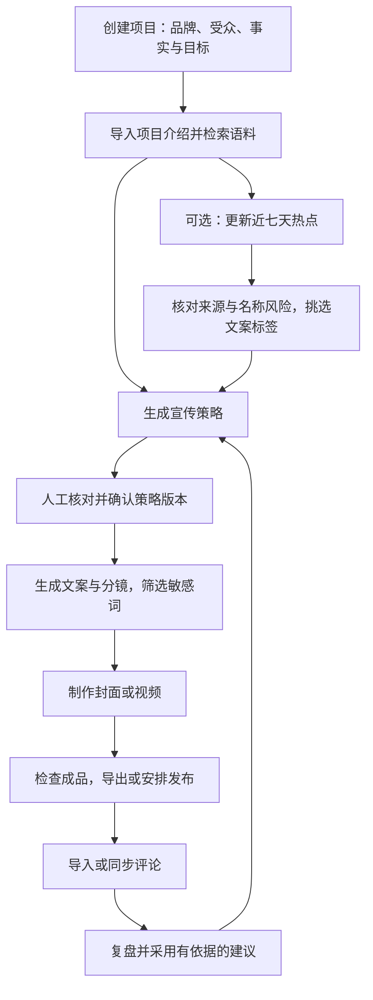

# 生长 STUDIO · AI 运营工作台

**从一个想法，到持续生长的品牌。**

生长 STUDIO 将品牌资料、项目语料、热点筛选、宣传策略、文案与封面、视频、发布记录和评论复盘连接在同一个工作区。面向独立创作者、小团队和早期品牌，让整理过的资料与反馈继续用于下一次创作。

**当前正式版：v1.0.0 · Windows x64。** 本版整合截至 v0.4.7 的功能，统一版本号与使用文档。Windows 应用内置后端和运行环境，解压即可运行，无需另装 Node.js。

## 下载与打开

| 入口 | 地址 / 说明 |
| --- | --- |
| **下载 v1.0.0 Windows 完整版** | [Shengzhang-Studio-1.0.0-windows-x64.zip](https://github.com/JerryCoal/shengzhang-studio/releases/download/v1.0.0/Shengzhang-Studio-1.0.0-windows-x64.zip) |
| 正式版发布说明 | [v1.0.0 Release](https://github.com/JerryCoal/shengzhang-studio/releases/tag/v1.0.0) |
| 最新发布入口 | [Releases / latest](https://github.com/JerryCoal/shengzhang-studio/releases/latest) |
| 文件完整性校验 | [SHA-256 校验文件](https://github.com/JerryCoal/shengzhang-studio/releases/download/v1.0.0/Shengzhang-Studio-1.0.0-windows-x64.zip.sha256) |
| 历史下载 | [所有已发布版本](https://github.com/JerryCoal/shengzhang-studio/releases) |
| 网页入口 | [GitHub Pages](https://jerrycoal.github.io/shengzhang-studio/)；在线 AI 和平台功能需要可用后端，不能用静态托管代替后端 |
| 项目源码 | [JerryCoal/shengzhang-studio](https://github.com/JerryCoal/shengzhang-studio) |

1. 下载 ZIP，**完整解压**，不要只取出 EXE，也不要直接在压缩包中运行。
2. 双击 `ShengzhangStudio.exe`，注册本地用户并记住密码。
3. 在工作台点击 **开始免费练习**，依次完成「确认策略 → 制作封面 → 导出素材包」。练习不需要 API 密钥。
4. 正式使用时创建自己的项目；在 **连接与设置** 中按需配置模型服务。
5. 左侧 **使用指南**、顶部问号或 **F1** 可随时查阅操作说明。

升级时，先在旧版托盘菜单选择 **退出并停止后台任务**，再打开完整解压后的新版。同一台电脑、同一 Windows 账户下，数据继续保存在 `%LOCALAPPDATA%\ShengzhangStudio`，不需要复制数据库到新版文件夹。仅关闭窗口会缩到托盘。

详细操作见 [v1.0.0 使用说明](docs/UPGRADE-1.0.0.md) 和 [Windows 使用说明](docs/WINDOWS-APP.md)。

## 工作流程



| 步骤 | 用户操作 | 工作台如何处理 |
| --- | --- | --- |
| 1. 建立项目 | 填写品牌、产品、受众、真实卖点、渠道和预算 | 项目资料自动保存，新项目保留草稿；事实、目标与渠道成为生成依据 |
| 2. 整理语料 | 导入 TXT、Markdown、DOCX、文字型 PDF，或粘贴介绍 | 提取正文、分段并在本地按关键词检索；可核对、停用或删除。扫描件需先转文字 |
| 3. 选择热点（可选） | 点击「更新近七天热点」，输入或点选项目关键词 | 读取选定公开中文新闻源，按日期、相关度与过滤词筛选；人物、作品、品牌候选需逐项确认，再生成标签 |
| 4. 形成策略 | 选择免费模板或文本 AI，核对主题、表达与 Prompt | 查询语料和已采用经验；确认后锁定版本并创建制作任务；修改已确认策略会另存草稿 |
| 5. 编写内容 | 用标签、语料引用补充要求，生成或编辑文案与分镜 | 按步骤组织提示词，在生成末尾按可维护词库筛选、替换敏感词；保留引用与命中记录 |
| 6. 制作画面 | 选择本地模板、Seedream 封面或 AI 视频 | 封面：预览提示词 → 候选生成 → 人工采用。视频：生成首尾帧 → 检查 → 提交 Seedance → 保存结果 |
| 7. 发布与记录 | 检查账号、成品、正文和时间，导出或启用有权限的任务 | 保存发布快照；小红书手动上传、登记链接，抖音可在权限齐备时投稿；平台确认公开后才标记成功 |
| 8. 评论与复盘 | 导入评论或同步自有抖音作品评论，核对并采用建议 | 去重、分类并保留原文依据；采用的经验进入下一轮策划 |

### 封面与视频怎么做

- **免费封面**：内容制作 → 图文任务 →「本地模板制作 · 免费」。可配合真实产品图，输出 900 × 1200 PNG。
- **Seedream 小红书封面**：配置 Seedream → 确认项目策略 → 小红书图文卡片「AI 封面 · Seedream」→ 选择风格、构图和要求 → 预览提示词与语料 → 确认生成 → 检查候选 →「确认采用为封面」。输出 1728 × 2304（3:4）。
- **AI 视频**：短片任务中，用 GPT Image 2 或 Seedream 生成并检查首尾关键帧，再提交 Seedance。图片和视频分别配置密钥。（ai视频尚未测试）
- **本地短片**：模板合成约 12 秒短片，可上传配音；输出格式由浏览器支持情况决定。素材包包含成品和配套文案。

Seedream 提示「模型或者接入点不存在」时，点击设置页模型输入框下方的同名小字，查看模型开通、接入点、区域、权限和请求示例。先选模型系列，再粘贴接入点 ID。

### 节省时间的地方

- **资料复用**：项目介绍整理一次，策略、文案和画面要求可检索引用，减少反复粘贴。
- **快捷输入**：点选场景标签补充要求，热点标签带来源线索，便于核对。
- **减少重复检查**：生成后执行可编辑的敏感词规则；草稿自动保存，成品保留历史版本。
- **按需使用模型**：本地模板和关键词检索无需模型；文本环节可独立选服务商与模型，付费生成先确认预算。
- **反馈复用**：评论保留原文与作用范围，采用的建议直接进入下一轮策划。

本地语料检索采用关键词匹配，不使用向量数据库；热点筛选不是全网热搜榜。名称风险提示和敏感词替换仍需人工审核。

## 服务与数据

| 能力 | 接口 / 方式 | 使用前提 |
| --- | --- | --- |
| 策略、文案、评论分类与复盘 | OpenAI / DeepSeek | 对应官方 API Key、模型权限及额度；每个文字环节可独立选择 |
| 小红书 AI 封面 | 火山方舟 Seedream | 北京区域已开通模型或可用接入点；图片密钥独立保存 |
| 视频首尾帧 | GPT Image 2 / Seedream | 对应图片服务权限与额度 |
| AI 视频 | Seedance（火山方舟 / BytePlus） | 对应区域密钥和支持首尾帧的模型或接入点 |
| 抖音投稿与评论同步 | 抖音开放平台 | 已审核应用、相关接口权限、账号 OAuth 授权；发布任务逐条确认 |（待完成，现在仍无法接入抖音平台，仍需手动）
| 小红书发布与评论 | 素材导出、手动发布、评论导入 | 当前未接入通用后台自动发布或自动抓取评论接口 |

Windows 版的用户、工作区和凭证在本机按用户加密保存；API 与平台凭证还使用 Windows 当前账户的 DPAPI 保护。勾选自动登录后，下次可点击用户进入，也可取消记住。密码无法找回；工作区备份为明文且不含 API 密钥，请自行保管。

调用 AI 或平台接口时，当前操作所需的资料与凭证会发送给对应服务商。**本地存储不等于完全离线调用。** 模型费用由用户自己的服务商账户承担，应用预算预留不是服务商账单的硬上限。

Windows 菜单「工作台 → 在浏览器中打开」提供连接本机后端的完整网页，与桌面窗口共用本机数据。独立联网网页版的浏览器加密工作区和后端代码保留，但当前没有承诺持续可用的公网后端；不同浏览器与设备不会自动同步。详见 [联网网页版说明](docs/WEB-LOCAL-DATA.md)。

## 截至 v1.0.0 的版本迭代

以下区分 GitHub 已发布版本与此前仅本地交付的迭代；未将本地版本描述成已存在的历史 Release。

| 版本 | 主要变化 | 记录 |
| --- | --- | --- |
| 早期 MVP / v0.1 | 项目资料、策略确认、本地封面短片、发布记录、评论复盘和下期策划 | [初版需求](docs/creator-marketing-app-v0.1.md)、[早期验证](docs/VERIFICATION.md) |
| v0.2 开发迭代 | API 模型分工、Windows 密钥保护、预算及诊断基础；扩展生成与平台接口 | [接口说明](docs/API-AND-MODELS.md) |
| v0.3.0 | Windows 独立应用、内置后端、本地用户登录、数据隔离与加密 | [GitHub Release](https://github.com/JerryCoal/shengzhang-studio/releases/tag/v0.3.0) |
| v0.4.0 | 快捷登录、项目文档语料库、可编辑敏感词库、项目自动保存 | [说明](docs/UPGRADE-0.4.0.md) / [下载](https://github.com/JerryCoal/shengzhang-studio/releases/tag/v0.4.0) |
| v0.4.1 | 区分 API 额度不足与频率限制，改善诊断与重试保护 | [说明](docs/UPGRADE-0.4.1.md) / [下载](https://github.com/JerryCoal/shengzhang-studio/releases/tag/v0.4.1) |
| v0.4.2 | DeepSeek 官方 API；两家文本模型按任务混用，密钥独立保存 | [说明](docs/UPGRADE-0.4.2.md) / [下载](https://github.com/JerryCoal/shengzhang-studio/releases/tag/v0.4.2) |
| v0.4.3 · 本地交付 | Seedream 图片接口，首尾帧可在 GPT Image 2 与 Seedream 间选择 | [说明](docs/UPGRADE-0.4.3.md) |
| v0.4.4 · 本地交付 | 免费练习、各页提示、可搜索指南、F1 帮助及下一步引导 | [说明](docs/UPGRADE-0.4.4.md) |
| v0.4.5 · 本地交付 | Seedream 小红书封面、候选采用、分步骤提示词、快捷标签与语料引用 | [说明](docs/UPGRADE-0.4.5.md) |
| v0.4.6 · 本地交付 | 近七天中文新闻、关键词匹配、候选与风险确认、项目热点标签 | [说明](docs/UPGRADE-0.4.6.md) |
| v0.4.7 · 本地交付 | Seedream 接入点问答、设置内入口、保留未保存输入的帮助体验 | [说明](docs/UPGRADE-0.4.7.md) |
| **v1.0.0 · 正式版** | **整合以上功能，公开完整项目源码，统一版本号、流程文档和正式下载入口** | [说明](docs/UPGRADE-1.0.0.md) / [正式版下载](https://github.com/JerryCoal/shengzhang-studio/releases/tag/v1.0.0) |

此前源码中的「0.5.0 联网网页版」是并行部署方案的标识，不是桌面 v0.4.7 之后单独发布的正式版本。相关代码在 v1.0.0 中统一版本号，公网部署状态见上文。

## 当前适用范围

- Windows x64 提供完整解压包，尚无签名安装器或自动升级程序。
- 已验证本地业务、模拟服务商接口与桌面启动。外部模型能否使用取决于账户权限、模型版本、余额及网络；真实平台投稿需完成自己的授权与联调。
- 自动任务需保持应用运行、电脑联网且不休眠。小红书目前采用手动流程；新闻仅覆盖选定来源返回的条目。
- Android / iOS 工程保留，尚未签名、真机验证或上架；当前不提供可直接安装的手机正式版。
- 适合个人与小团队本地工作区，未提供团队权限、云端同步或大规模任务队列。

## 生成成本分析

- 生成一个5-10个辅助资料的宣传文案，大概需要<= 0.4 ＄的花费


## 开发与构建

Node.js **22.13+**；Windows 发布包使用 Node.js 24。依赖由 `pnpm-lock.yaml` 锁定。

```sh
npm install -g pnpm@11.19.0
pnpm install --frozen-lockfile
pnpm dev
```

开发页面 `http://127.0.0.1:5173`，API `http://127.0.0.1:4318`。

```sh
pnpm test                  # 业务与接口测试，不调用付费 API
pnpm build                 # 类型检查与桌面前端构建
pnpm start:windows-web     # Windows 独立用户后端，默认本机 4319
pnpm run build:web         # 联网网页版前端；还需要部署后端
pnpm run build:static      # 静态体验版，不提供在线 AI 和平台调用
```

Windows 打包前，将官方 `electron-v44.3.0-win32-x64.zip` 放入 `.tools/`；构建脚本会校验内置 SHA-256，不接受不匹配的运行组件。随后执行：

```sh
pnpm build
pnpm run build:windows
node scripts/package-windows.mjs
```

输出 `outputs/Shengzhang-Studio-1.0.0-windows-x64.zip`，构建所用 Node 一起打包。仓库不包含第三方运行组件压缩包、用户数据、测试产物或个人密钥。原生工程构建前需执行 `pnpm native:sync`，再使用 Android Studio 或 macOS/Xcode。

```text
src/          页面、输入辅助、浏览器工作区、图文与视频制作
server/       后端、模型适配、语料检索、热点、用户与凭证保护
desktop/      Windows 窗口、托盘及后台启动
tests/        业务与接口测试
public/       图标、PWA 和本地 PDF 读取资源
scripts/      开发、构建、打包与启动
docs/         使用说明、版本迭代和历史验证；保留原 Pages 文件
android/      安卓工程（待签名与真机验证）
ios/          iOS 工程（待签名与真机验证）
```

更多文档：[提示词与输入辅助](docs/PROMPT-WORKFLOW.md) · [生成与平台连接](docs/GENERATION-AND-PLATFORMS.md) · [部署说明](docs/DEPLOYMENT.md)。历史文档描述对应版本，当前功能与下载以本 README 和 v1.0.0 发布说明为准。
